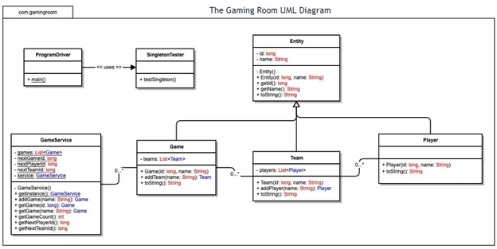

# CS 230 – Operating Platforms  
## Software Design Document Portfolio Artifact

**Student:** Erica Kinch  
**Course:** CS 230 – Operating Platforms  
**Term:** 2026 C-2 (Mar–Apr)  
**Artifact:** Software Design Document  
**Client:** The Gaming Room  

---

## Overview

This repository contains my CS 230 portfolio artifact: a completed **software design document** created for **The Gaming Room**. This project focused on evaluating operating platforms, system architecture, and software design decisions for a multi-user game application.

The purpose of this artifact is to demonstrate my ability to analyze technical requirements, compare platform options, apply software design principles, and communicate recommendations clearly to both technical and non-technical audiences.

## Project Artifacts

- [View the Software Design Document](docs/The_Gaming_Room_Software_Design_Document.pdf)

## UML Domain Model



---

## About the Client

The client for this project was **The Gaming Room**, a company that wanted to expand its game, **Draw It or Lose It**, into a web-based application that could operate across multiple platforms.

Their software needed to support:

- Multiple teams and players
- Unique game and team names
- Reliable multi-user functionality
- Scalability across operating environments
- A design that could support future growth and deployment needs

---

## Repository Structure

```text
cs230-operating-platforms/
├── README.md
├── LICENSE
└── docs/
    ├── The_Gaming_Room_Software_Design_Document.pdf
    └── uml-domain-model.png
```

---

## Repository Contents

- `README.md` – project overview and portfolio reflection
- `docs/The_Gaming_Room_Software_Design_Document.pdf` – completed software design document
- `LICENSE` – repository license information

---

## Reflection

### Briefly summarize The Gaming Room client and their software requirements. Who was the client? What type of software did they want you to design?

The client was **The Gaming Room**, a company seeking to expand its existing game, **Draw It or Lose It**, into a web-based, multi-platform software application. They needed a system design that could support multiple users and teams, enforce unique naming rules, and function reliably across different operating platforms. The software also needed to be scalable, maintainable, and appropriate for a distributed environment.

### What did you do particularly well in developing this documentation?

One of the strongest parts of my work was connecting technical recommendations to the client’s actual needs. Rather than only listing the characteristics of different platforms or design choices, I focused on explaining why certain options made more sense for this specific application. I also organized the document so the recommendations were easier to follow, which made the final product more useful as both a technical and business communication tool.

### What about the process of working through a design document did you find helpful when developing the code?

Working through the design document first helped me think through the system before implementation. It made me identify constraints, examine trade-offs, and define the application more clearly at a high level. That process is helpful because it reduces ambiguity later in development. Instead of jumping directly into code, I had already considered architecture, platform compatibility, storage, memory management, networking, and security concerns. That kind of planning makes development more efficient and reduces unnecessary rework.

### If you could choose one part of your work on these documents to revise, what would you pick? How would you improve it?

If I were revising one part of the document, I would strengthen the platform comparison and recommendation sections even more. I would expand the discussion of long-term maintenance, deployment complexity, and cost trade-offs so the recommendation feels even more complete from both a technical and operational standpoint. While the original analysis was solid, adding more detail in those areas would make the final recommendation more strategic and persuasive.

### How did you interpret the user’s needs and implement them into your software design? Why is it so important to consider the user’s needs when designing?

I interpreted the user’s needs by focusing on the problem the client was actually trying to solve, not just the request to build software. The Gaming Room needed an application that could support multiple users, maintain consistent rules, operate across platforms, and scale with future growth. I translated those needs into design decisions related to architecture, platform selection, object relationships, system constraints, storage, and security. Considering the user’s needs is essential because even a technically strong solution can fail if it does not solve the right problem. Good design starts with understanding what the client needs the software to do and why.

### How did you approach designing software? What techniques or strategies would you use in the future to analyze and design a similar software application?

My approach to software design was structured and requirements-driven. I started by identifying the business need, then broke the problem into major technical categories such as operating platform, architecture, storage, memory, distributed systems, and security. From there, I evaluated options and made recommendations based on fit, trade-offs, and long-term practicality. In the future, I would use the same overall strategy: begin with requirements analysis, model the system carefully, compare technical options, and justify design decisions before implementation begins. I would also continue using software design patterns and UML-style thinking to make system design easier to communicate and maintain.

---

## Skills Demonstrated

Through this project, I demonstrated the ability to:

- Analyze software requirements and business needs
- Evaluate multiple operating platforms
- Compare architectural and deployment options
- Apply software design principles and patterns
- Consider scalability, maintainability, and security
- Create technical documentation for stakeholders
- Communicate design decisions clearly and professionally

---

## Course Connection

This artifact reflects key learning from **CS 230: Operating Platforms**, especially evaluating platform options, analyzing system architecture, and using software design documentation to support technical decision-making. Through this project, I practiced comparing operating environments, identifying trade-offs, and recommending a solution that aligned with both technical requirements and client goals.

---

## Closing Reflection

This project reinforced that strong software development starts with strong design. Before implementation, it is important to understand the client’s goals, identify system constraints, and carefully evaluate technical trade-offs. Completing this artifact strengthened my ability to think through platform and architectural decisions in a structured way and to communicate those decisions clearly through professional documentation.

